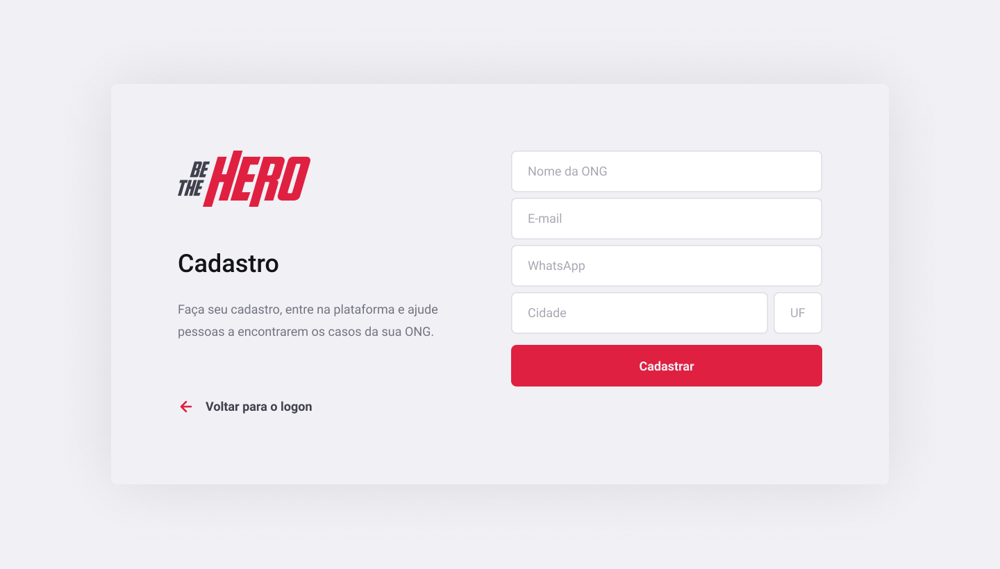
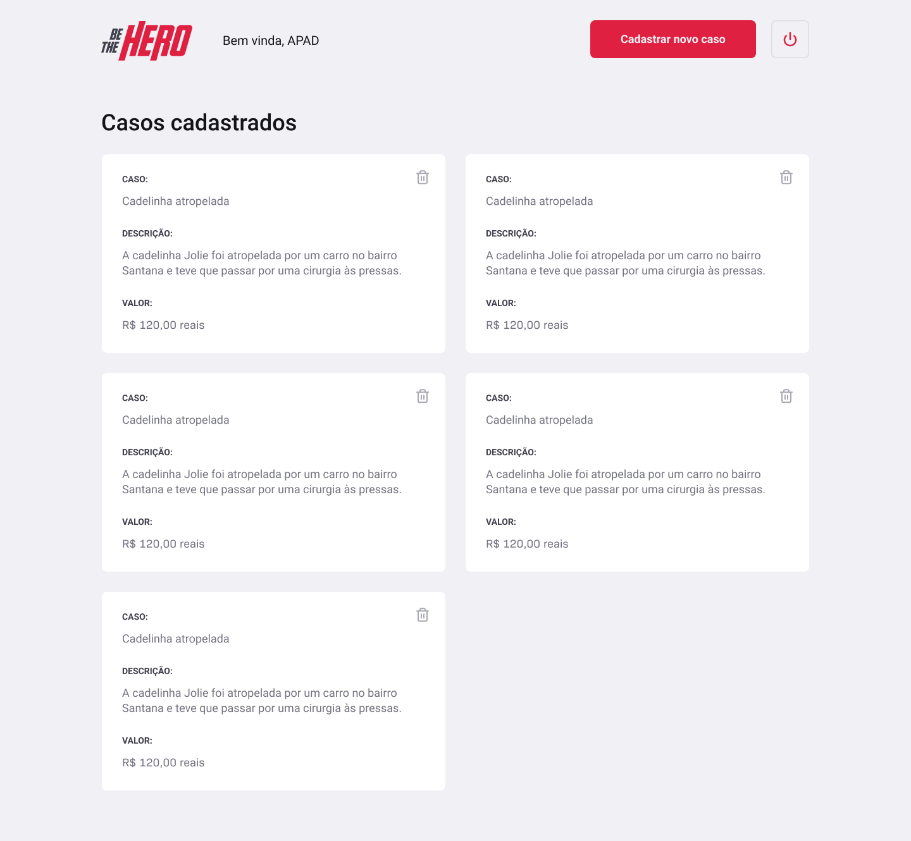

<h1 align="center">Frontend</h1>
<h4 align="center">
   
</h4>

  <a href="#wrench-built-with">Built With</a>&nbsp;&nbsp;&nbsp;|&nbsp;&nbsp;&nbsp;
  <a href="#-about">About</a>&nbsp;&nbsp;&nbsp;|&nbsp;&nbsp;&nbsp;
  <a href="#electric_plug-how-to-set-up">How to Set Up</a>&nbsp;&nbsp;&nbsp;|&nbsp;&nbsp;&nbsp;
  <a href="#page_facing_up-pages">Pages</a>&nbsp;&nbsp;&nbsp;|&nbsp;&nbsp;&nbsp;
  <a href="#pencil-author">Author</a>

## :wrench: Built With

- [React](https://reactjs.org)

## 💻 About

This is the frontend of the Be the Hero application.

## :electric_plug: How to Set Up

- Clone the project: `git clone https://github.com/Lukazovic/Be-The-Hero.git`;
- Go to the project folder: `cd Be-The-Hero`;
- Go to the frontend folder: `cd frontend`;
- Download the dependencies: `npm install`;
- Start the application: `npm start`.

It will open a browser page (if it doesn't, go to [http://localhost:3000](http://localhost:3000/)).

> **Important:** In order to see all the incidents and make the system works it is required to start the [Backend](https://github.com/Lukazovic/be-the-hero/tree/master/backend#backend).

## :page_facing_up: Pages

<h3 align="center">Register New ONGs</h3>
<h4 align="center">
   
</h4>

<h3 align="center">Login</h3>
<h4 align="center">
   
</h4>

<h3 align="center">Add New Incident</h3>
<h4 align="center">
   
</h4>

<h3 align="center">Show All Incidents</h3>
<h4 align="center">
   
</h4>

## :pencil: Author

<table>
  <tr>
    <td align="center"><a href="https://github.com/Lukazovic"> <b>Lucas Vieira</b></a> </td>
  <tr>
</table>
